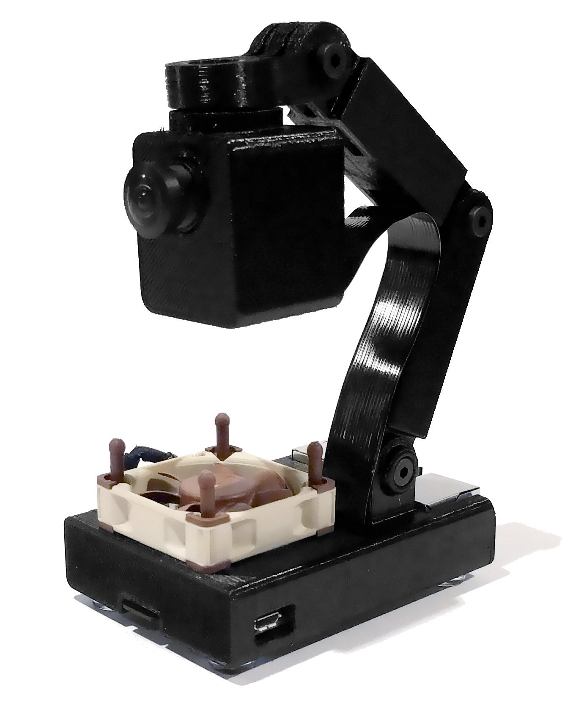

# Hardware

This is a case for a Raspberry Pi running Basket (referred to as the Basket Case).

The case was designed in [Fusion 360](https://www.autodesk.com/products/fusion-360/overview). A `.f3d` file is included for editing in Fusion and a STEP file is included for editing elsewhere. STLs are also included for 3d printing without modification.

# License

Unlike the source code for the Basket software, the hardware is licensed under a [Creative Commons Attribution-Non-Commercial-ShareAlike 3.0](https://creativecommons.org/licenses/by-nc-sa/3.0) license in order to comply with the licenses of [other designs](CREDITS.md) this case is a derivative of.
