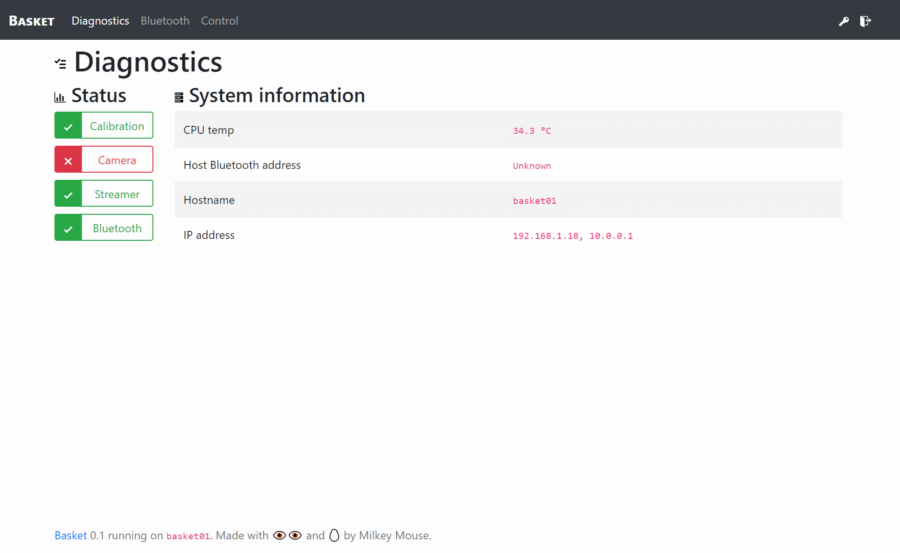
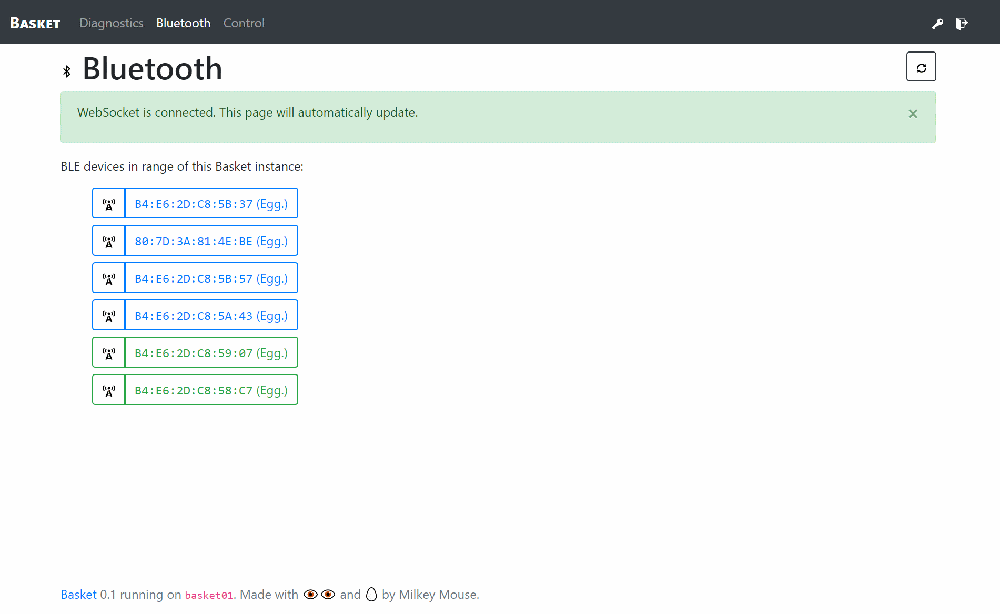

# Basket Server

This server process can run on a Raspberry Pi (perhaps in the [Basket Case™](../hw/case)?) or other system with Bluetooth and control [Bluetooth egg cups](../hw/cup).

For stereo vision and redundancy, we'd recommend dividing the egg cups evenly between multiple instances of the Basket Server; after all, one shouldn't put all their eggs in one Basket™.

# Setup

To install dependencies, initialize the database, and start the server, simply run `make`.

## Camera Compatibility
Basket was designed to run on a Raspberry Pi with an [official](https://www.amazon.com/dp/B01ER2SKFS) or [unofficial](https://www.amazon.com/dp/B00N1YJKFS) (recommended) Pi Camera in our custom [Basket Case™](hw/README.md).
The default interface to the Pi Camera (where userspace uses MMAL directly) is not compatible with OpenCV, the mjpg-streamer plugin, or [uwsgi-capture](https://github.com/milkey-mouse/uwsgi-capture). To make a long story short, you can make the Pi Camera act as a normal webcam by loading the Video4Linux driver:

    sudo raspi-config # enable the Pi Camera
    # make sure it will use the v4l driver
    sudo modprobe bcm2835-v4l2
    sudo sh -c 'echo bcm2835-v4l2 >> /etc/modules'
